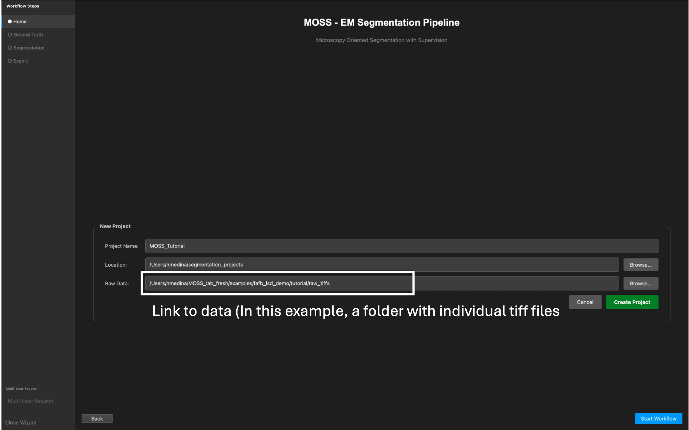
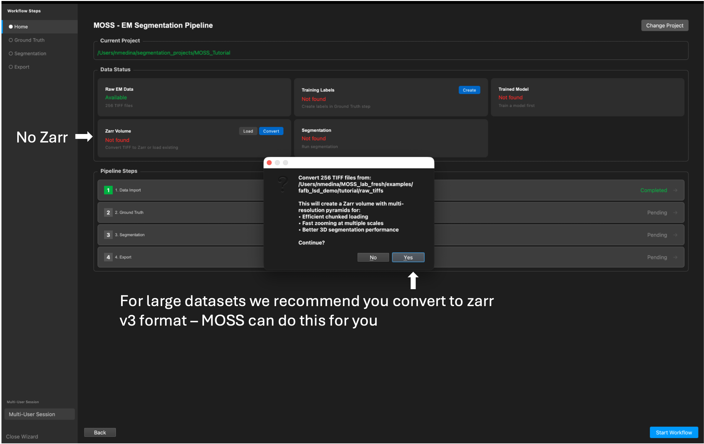
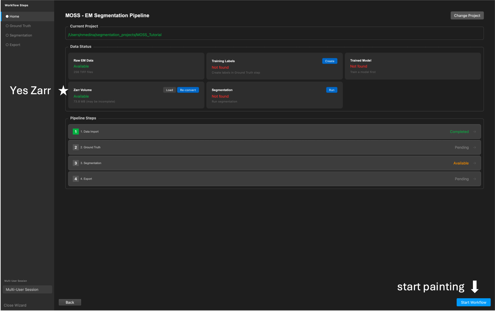
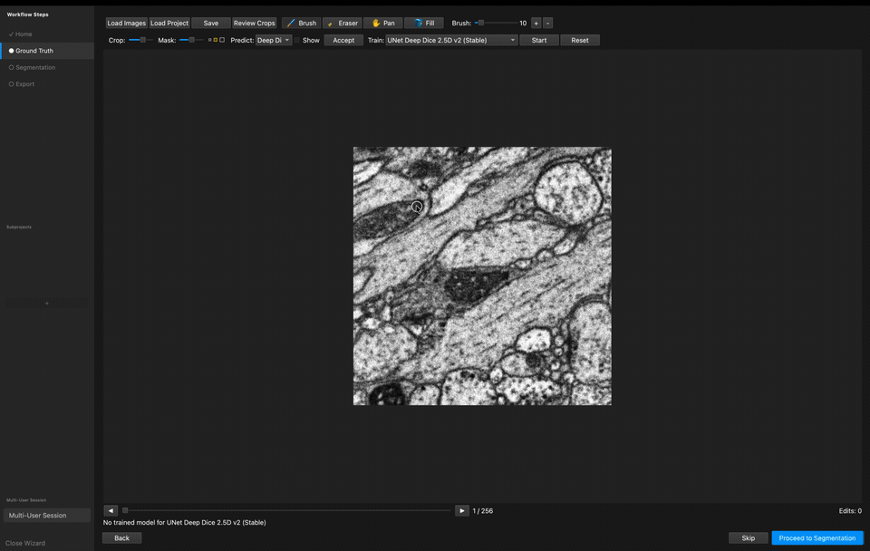
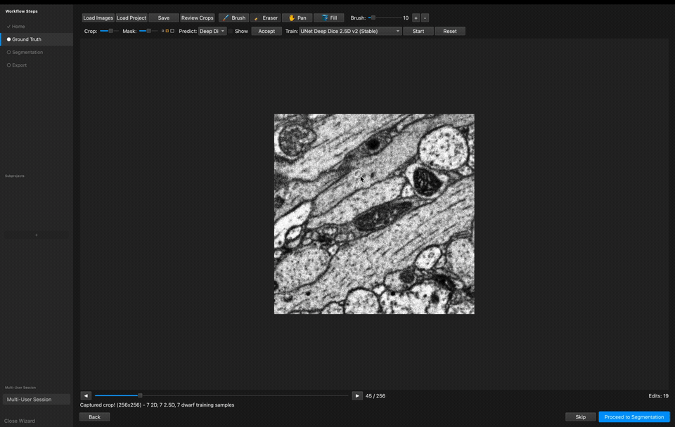
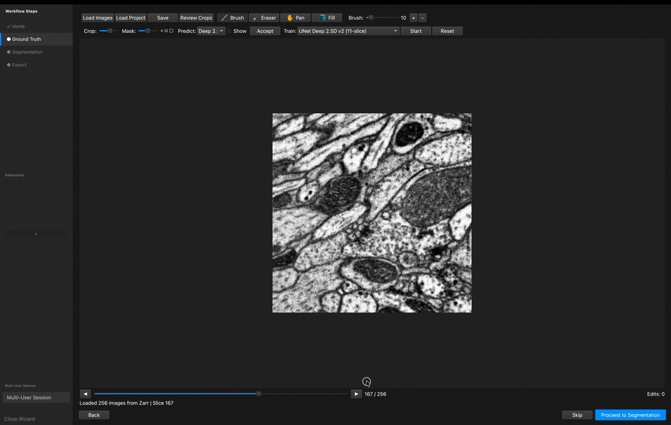
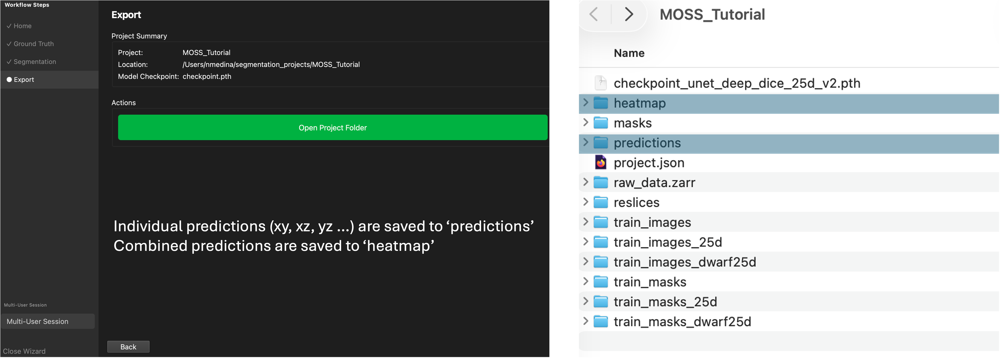

# MOSS tutorial — from raw TIFFs to predictions

A complete, self-contained walkthrough of the MOSS workflow using a small block
of real EM data that ships **inside this repo** — no download, no credentials, no
GPU required (though a GPU is faster).

You will download a small block of real EM data, create a project from those TIFF
slices, let MOSS build a Zarr pyramid, paint a little ground truth, train, watch
live predictions, run the multi-view segmentation, and find your results on disk.

## Get the tutorial data

The raw EM block is **not committed** to the repo (to keep it light). Download it
once with the bundled script — a **512 × 512 × 256** block (256 TIFF slices,
~60 MB) from the public Full Adult Fly Brain volume (FAFB v14 CLAHE, 8 nm; Zheng
et al. 2018):

```bash
cd examples/fafb_lsd_demo/tutorial
pip install cloud-volume        # one-time (public data, no credentials)
python download_data.py         # writes raw_tiffs/
```

It arrives as loose TIFF slices on purpose — the first thing you do in MOSS is turn
them into a Zarr pyramid, exactly as you would for your own data.

> **Setup:** install MOSS as described in the repository's main README, then
> launch it with `moss`.

---

## 1. Create a new project

Open MOSS and create a **New Project** — set the **name**, **location**, and
**Raw Data**. If you don't already have a Zarr v3 pyramid, we recommend pointing
Raw Data at a folder of individual TIFF files (here, the bundled `raw_tiffs`
folder) and letting MOSS generate the Zarr pyramid for you.

```
<repo>/examples/fafb_lsd_demo/tutorial/raw_tiffs
```



When a project has raw TIFFs but no Zarr yet, click **Convert**: MOSS builds a
chunked **Zarr v3** pyramid (efficient chunked loading, fast multi-scale zooming,
better 3D segmentation performance).



## 2. Start the workflow

Once conversion finishes, the **Zarr Volume** card turns **Available**. Click
**Start Workflow** (bottom-right) to open the Ground Truth step and begin.



---

## 3. Paint, train, and predict

MOSS lets you paint, train, and predict **at the same time** — the loop below is
fully interactive.

**1. Start painting masks.** Paint over the structures you want to segment, and
press **Tab** to lock in a ground-truth crop.



**2. Review your crops.** You can review the crops you've captured at any time and
remove any bad ones.



**3. Start training.** Once you have a few crops, pick a model from the **training**
dropdown and start training. You can keep working and painting while the model
trains.


**4. Show live predictions.** After the first epoch, select the same model from the
**predict** dropdown and check the **Show** box (or press **S**) to display the
live predictions in green. You can train, predict, and paint all at once.


**5. Run the segmentation.** When you're happy with the prediction quality, go to
the **Segmentation** tab, choose the model to use, and whether to run prediction on
reslices of the data (multi-view). Then run it.



---

## 4. Where the results are saved

The predictions are written into the project folder: individual per-view
predictions (`xy`, `xz`, `yz`, and the diagonal views) land in **`predictions/`**,
and the combined multi-view result lands in **`heatmap/`**. The converted volume
lives in `raw_data.zarr/`, and your painted labels / training crops are under the
`train_*` and `masks` folders.



---

## Notes

- Everything MOSS generates while you run the tutorial (`raw_data.zarr/`,
  `predictions/`, `heatmap/`, checkpoints, …) is git-ignored, so re-running it
  won't dirty the repo.
- The GIFs are sped up 3× and have no audio. To regenerate one from a new screen
  recording, use `scripts/mov_to_gif.sh recording.mov media/tutorial_clip_N.gif`.
